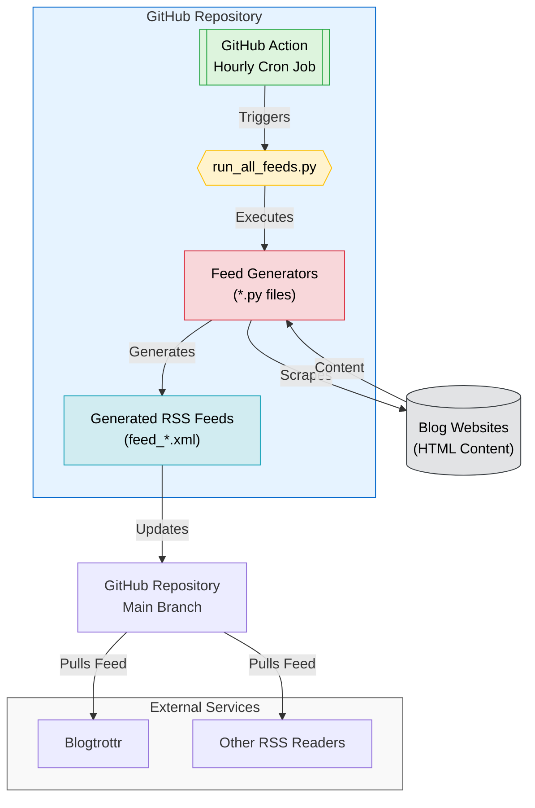

# RSS Feed Generator <!-- omit in toc -->

[](https://github.com/bohnen/rss-feeds/actions/workflows/run_feeds.yml)
[](https://github.com/bohnen/rss-feeds/actions/workflows/run_selenium_feeds.yml)
[](https://github.com/bohnen/rss-feeds/actions/workflows/validate_feeds.yml)

> [!TIP]
> This project is maintained by [@oborchers](https://github.com/oborchers) and [@Olshansk](https://github.com/Olshansk). If you gut any value out of it, consider sponsoring us on GitHub!

> [!NOTE]
> Read the blog post about this repo: [No RSS Feed? No Problem. Using Claude to automate RSS feeds.](https://olshansky.substack.com/p/no-rss-feed-no-problem-using-claude)

## tl;dr Available RSS Feeds <!-- omit in toc -->

This fork generates **daily at 00:00 JST** (cron `0 15 * * *` UTC) and publishes the following feeds. All other feeds from the upstream project are disabled here — subscribe to them from [Olshansk/rss-feeds](https://github.com/Olshansk/rss-feeds#tl;dr-available-rss-feeds--omit-in-toc).

| Blog | Feed |
| --- | --- |
| [DeepSeek News](https://api-docs.deepseek.com/news/) | [feed_deepseek.xml](https://raw.githubusercontent.com/bohnen/rss-feeds/main/feeds/feed_deepseek.xml) |
| [MiniMax News](https://www.minimax.io/news) | [feed_minimax.xml](https://raw.githubusercontent.com/bohnen/rss-feeds/main/feeds/feed_minimax.xml) |
| [Moonshot AI / Kimi Blog](https://www.kimi.com/en/blog/) | [feed_moonshot.xml](https://raw.githubusercontent.com/bohnen/rss-feeds/main/feeds/feed_moonshot.xml) |
| [Nous Research Blog](https://nousresearch.com/blog) | [feed_nous.xml](https://raw.githubusercontent.com/bohnen/rss-feeds/main/feeds/feed_nous.xml) |
| [Qwen Blog](https://qwen.ai/blog) | [feed_qwen.xml](https://raw.githubusercontent.com/bohnen/rss-feeds/main/feeds/feed_qwen.xml) |
| [Z.ai Release Notes](https://docs.z.ai/release-notes/new-released) | [feed_zai.xml](https://raw.githubusercontent.com/bohnen/rss-feeds/main/feeds/feed_zai.xml) |

## Table of Contents <!-- omit in toc -->

- [Quick Start](#quick-start)
  - [Subscribe to a Feed](#subscribe-to-a-feed)
  - [Request a new Feed](#request-a-new-feed)
- [Create a new a Feed](#create-a-new-a-feed)
- [Star History](#star-history)
- [Ideas](#ideas)
- [How It Works](#how-it-works)
  - [For Developers 👀 only](#for-developers--only)

## Quick Start

### Subscribe to a Feed

- Go to the [feeds directory](./feeds).
- Find the feed you want to subscribe to.
- Use the **raw** link for your RSS reader. Example:

  ```text
    https://raw.githubusercontent.com/bohnen/rss-feeds/main/feeds/feed_ollama.xml
  ```

- Use your RSS reader of choice to subscribe to the feed (e.g., [Blogtrottr](https://blogtrottr.com/)).

### Request a new Feed

Want me to create a feed for you?

[Open a GitHub issue](https://github.com/bohnen/rss-feeds/issues/new?template=request_rss_feed.md) and include the blog URL.

If I do, consider supporting my 🌟🧋 addiction by [buying me a coffee](https://buymeacoffee.com/olshansky).

## Create a new a Feed

1. Download the HTML of the blog you want to create a feed for.
2. Open Claude Code CLI
3. Tell claude to:

```bash
Use /cmd-rss-feed-generator to convert @<html_file>.html to a RSS feed for <blog_url>.
```

## Star History

[](https://star-history.com/#Olshansk/rss-feeds&Date)

## Ideas

- **X RSS Feed**: Going to `x.com/{USER}/index.xml` should give an RSS feed of the user's tweets.

## How It Works



### For Developers 👀 only

- Open source and community-driven 🙌
- Simple Python + GitHub Actions 🐍
- AI tooling for easy contributions 🤖
- Learn and contribute together 🧑‍🎓
- Streamlines the use of Claude, Claude Projects, and Claude Sync
